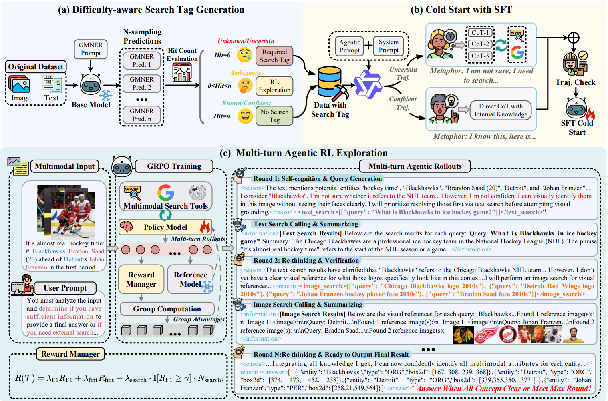

# SAKE: Search-Augmented Knowledgeable Entity Recognition

## 👋 Introduction
This repo is the official implementation of **SAKE**, an end-to-end agentic model for multimodal named entity recognition. SAKE enables a multimodal model to reason over a social media post, decide whether external textual or visual knowledge is needed, call search tools when necessary, and predict multimodal named entities with entity types and image regions. For details, please see our [SAKE paper](https://arxiv.org/abs/2604.20146).

<p align="center">
  
</p>

## 🌎 Setup
**Step 1: Cold-start SFT environment**
```bash
conda env create -f cold_start/train/environment.conda.yaml
conda activate swift
```

**Step 2: Agentic RL environment**
```bash
conda create -n sake_rl python=3.10 -y
conda activate sake_rl

cd verl
pip install -e .
cd ..

pip install vllm==0.8.2
pip install transformers==4.51.0
pip install flash-attn==2.7.4.post1
pip install qwen-vl-utils openai python-dotenv pillow requests
```

**Step 3: Search environment**

SAKE supports offline cached search and online search. For online search, create a `.env` file:
```bash
SERPER_API_KEY=your_google_serper_key

# For text-search summarization
LLM_API_KEY=your_llm_key
LLM_BASE_URL=https://your-llm-endpoint/v1
MODEL_NAME=your_model_name
```

## 📂 Download the Dataset and Models

Uploading all data, model checkpoints, and search caches will take some time. We are actively working on the release.

- 📦SeCoT data: TODO
- 📦RL Data: TODO
- 📦Search cache: TODO
- 📦Model checkpoints: TODO

## ▶️ Training
SAKE follows a two-stage training pipeline: cold-start SFT followed by agentic RL.

### Step 1: Cold-Start SFT
Edit `cold_start/train/run.sh` with your base model, SeCoT training data path, and output path:
```bash
bash cold_start/train/run.sh
```

### Step 2: Agentic RL
For Twitter-GMNER:
```bash
bash sake_rl/scripts/run_twitter_grpo_gmner.sh
```

For Twitter-FMNERG:
```bash
bash sake_rl/scripts/run_twitter_grpo_fmnerg.sh
```

Before training, edit the scripts with your:

- RL training and validation parquet paths
- search cache path
- cold-start checkpoint path
- GPU and batch-size settings (at least 8x80GB GPUs is recommended for RL training)

> Note that agentic RL with online search is resource-intensive and requires a stable network environment. We provide search caches to reproduce our results. You can still enable online-search rollout by calling [online_search_tools.py](sake_rl/utils/tools/online_search_tools.py).

### Step 3: Merge Checkpoints
To convert an RL checkpoint to safetensors format, edit `sake_rl/scripts/merge_model.sh` and run:
```bash
bash sake_rl/scripts/merge_model.sh
```

## 🤗 Evaluation

### Step 1: vLLM Serving (Optional)
Edit `sake_rl/scripts/vllm_start.sh` with your model path and port, then run:
```bash
bash sake_rl/scripts/vllm_start.sh
```

### Step 2: Inference and Evaluation
Edit `sake_rl/scripts/run_inference_twitter_gmner.sh`:

- `TEST_DATA`: test file path, such as `twitter_fmnerg_gt.json`
- `IMAGE_ROOT`: image directory
- `SEARCH_CACHE_PATH` (optional): search cache path
- `ONLINE_SEARCH` (optional): whether to use Google Serper API for online search
- `OUTPUT_FILE`: prediction output path
- `INFERENCE_MODE`: OpenAI-compatible API or standard Transformers
- `API_BASE`: OpenAI base URL
- `MODEL_NAME`: model name for evaluation
- `TASK_TYPE`: `gmner` or `fmnerg`
- `PROMPT`: Please select prompt for gmner or fmnerg according to `TASK_TYPE`
- 
Run:
```bash
bash sake_rl/scripts/run_inference_twitter_gmner.sh
```

Set `ONLINE_SEARCH=true` to use online search; set it to `false` to use cached search. Because Google Serper API results are dynamic, results produced with online search may differ slightly from the paper.

## 🫡 Citation
If you find this repository helpful, a citation to our paper would be greatly appreciated.

```bibtex
@article{tang2026sake,
  title={SAKE: Self-aware Knowledge Exploitation-Exploration for Grounded Multimodal Named Entity Recognition},
  author={Tang, Jielong and Yuan, Xujie and Liu, Jiayang and Yu, Jianxing and Dong, Xiao and Chen, Lin and Teng, Yunlai and Di, Shimin and Yin, Jian},
  journal={arXiv preprint arXiv:2604.20146},
  year={2026}
}
```

## 🙏 Acknowledgement
SAKE builds on several open-source projects, including [H-index](https://github.com/NUSTM/GMNER/tree/main), [MMSearch-R1](https://github.com/EvolvingLMMs-Lab/multimodal-search-r1), [verl](https://github.com/verl-project/verl) and [ms-swift](https://github.com/modelscope/swift). Thanks for their great work!
